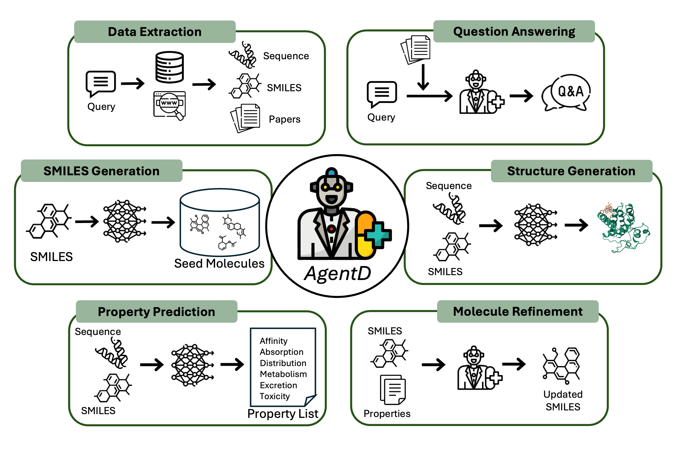

# agentD


[](https://opensource.org/licenses/MIT)

**agentD** is an open-source Python package designed to accelerate drug discovery workflows using Large Language Models (LLMs) and AI-driven tools. It provides modular agents and utilities for tasks such as literature extraction, molecular property prediction, molecule generation, and more. agentD integrates with external APIs (e.g., OpenAI, Serper) and cheminformatics libraries, enabling both automated and interactive research pipelines.


<p align="center">
  
</p>

---

## Installation

1. **Clone the repository:**
    ```sh
    git clone https://github.com/hoon-ock/llm-dd.git
    cd llm_dd
    ```

2. **Install dependencies in editable mode:**
    ```sh
    pip install -e .
    ```
    Or, to install all dependencies directly:
    ```sh
    pip install -r requirements.txt
    ```

3. **Install REINVENT4 (required for some tools):**
    ```sh
    git clone https://github.com/MolecularAI/REINVENT4.git
    cd REINVENT4
    python install.py --help
    python install.py cu124  # or rocm6.2.4, cpu, mac, etc.
    ```

---

## Configuration

- **API Keys:**  
  After installation, fill in your Serper API key and OpenAI API key in [configs/secret_keys.py](./configs/secret_keys.py):
    ```python
    # configs/secret_keys.py
    serper_api_key = "YOUR_SERPER_API_KEY"
    openai_api_key = "YOUR_OPENAI_API_KEY"
    ```

- **Global Variables:**  
  The file [configs/tool_globals.py](./configs/tool_globals.py) contains global variables used by the tools. You can edit this file to adjust default behaviors and settings.

---

## Example Notebooks

Example Jupyter notebooks demonstrating the main workflows are provided in the [test_case](http://_vscodecontentref_/2) directory:

- `1. extraction.ipynb` – Data extraction workflow
- `2. qna.ipynb` – Question answering with LLM agent
- `3. pooling.ipynb` – Pooling and data aggregation
- `4. prediction.ipynb` – Affinity prediction
- `5. refinement.ipynb` – Molecule refinement
- `6. generation.ipynb` – Molecule generation

You can run these notebooks step-by-step to see how to use the package for various drug discovery tasks.

---

## License

This project is licensed under the MIT License.

---

## Notes

- Make sure to set up your API keys before running any LLM agent notebooks.
- For any additional dependencies (e.g., REINVENT4), follow the instructions above.
- If you encounter missing package errors, check that all dependencies in [requirements.txt](./requirements.txt) are installed.

---

## Citation

If you use **agentD** in your research or project, please cite:

(soon to be updated)

```bibtex
@article{ock2025agentd,
  title={Large Language Model Agent for Modular Task Execution in Drug Discovery},
  author={Hoon Ock},
  journal={arXiv preprint arXiv:xxxx.xxxxx},
  year={2025},
  url={https://arxiv.org/abs/xxxx.xxxxx}
}

---

## Contact

For questions, suggestions, or support, please contact:  
Email: [jock@andrew.cmu.edu](mailto:jock@andrew.cmu.edu)